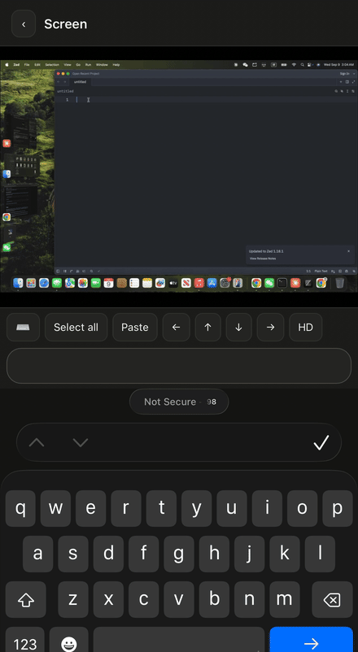
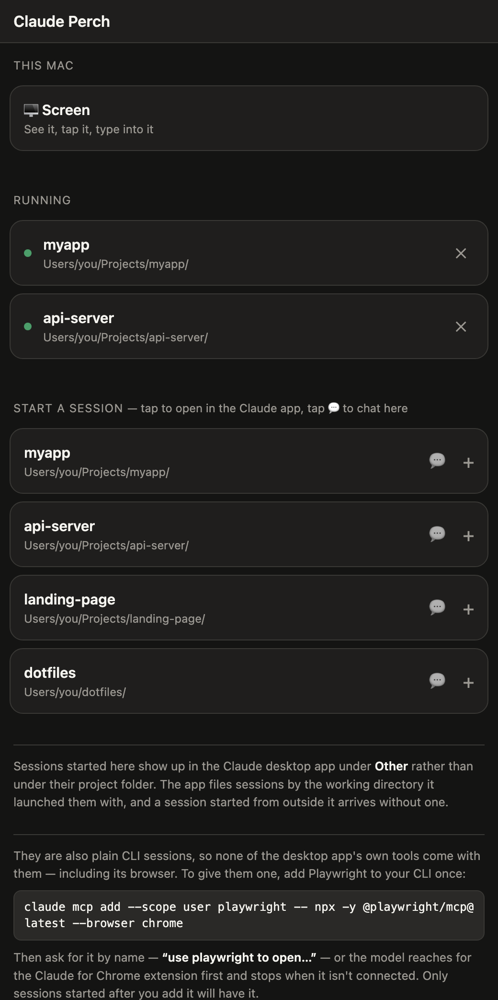

# Claude Perch

**Start Claude Code sessions on your computer, from your phone.**

<p align="center">
  
</p>

Claude Code's Remote Control lets your phone *take over* a session — but the
session has to already exist, which means walking back to your computer and
typing `claude` first. Perch closes that gap: it's a small always-on service on
your machine that lists your project directories on a mobile web page. Tap one,
and a real Claude Code session starts on your computer in that directory and
opens in the Claude mobile app a few seconds later.

Nothing is patched or reverse-engineered. Perch drives the official CLI —
`claude --remote-control` for app sessions, and the documented headless
streaming interface (`claude -p --output-format stream-json`) for in-page chat.

---

## What it looks like



Your project directories, on a page your phone can reach. Tap a row and a real
Claude Code session starts on the computer in that directory, then opens in the
Claude app a few seconds later. Tap 💬 instead and the conversation renders in
the page itself.

**Screen** at the top is the other half: the Mac's display, streamed to the
phone, with taps, scrolls and keystrokes going back the other way — for the
things an agent shouldn't be doing on your behalf.

<br clear="right">

---

## Two modes

| | **App mode** (tap the row) | **Web mode** (tap 💬) |
|---|---|---|
| Runs | `claude --remote-control` in tmux | `claude -p` streaming JSON |
| You chat in | The Claude mobile app | This web page |
| Images, permission prompts, voice | Yes | No |
| Needs Remote Control on your plan | Yes | No |
| Attach from your computer | `tmux attach -t perch-…` | `claude --resume <id>` |

App mode is the good one. Web mode is the fallback for when Remote Control
isn't available to you, or the relay is having a bad day.

Two things to know about app mode.

The session shows up in the Claude desktop app on your Mac under **Other**, not
under its project folder. The desktop app files sessions by the working
directory it launched them with, and a session started from outside it arrives
without one. The transcript, the directory and `claude --resume` all work
normally — it is only where the sidebar puts it.

And these are plain CLI sessions, so they do not get the tools the desktop app
injects into sessions *it* starts — its built-in browser, computer use, and the
rest. A Perch session sees whatever MCP servers your own CLI config has, which
by default is none. If you want the agent to browse, give the CLI its own
browser:

```bash
claude mcp add --scope user playwright -- \
  npx -y @playwright/mcp@latest --browser chrome --user-data-dir ~/.claude-browser
```

That runs real Chrome with its own persistent profile, so logins survive
between sessions — and when it hits one it can't solve, screen mode is right
there for you to type the password yourself.

One catch worth knowing before you go looking for a bug. The CLI also ships
tools for the Claude for Chrome extension, and they sit in the same tool list.
Asked to "open a browser", the model tends to reach for those first, and if the
extension isn't connected it reports that and stops — with a perfectly good
Playwright sitting right there unused. Either name the tool ("use playwright
to open …"), or settle it once in `~/.claude/CLAUDE.md`:

```
Browser work: use the playwright MCP tools. The Claude for Chrome extension is
not connected on this machine, so claude-in-chrome tools will always fail.
```

MCP servers are read when a session starts, so a session already running when
you add this won't see it. Start a new one.

---

## Screen mode

Tap **🖥 Screen** at the top of the page to see this Mac's display on your
phone, and to drive it. It exists for the things an agent can't do for you:
a login form, a captcha, a 2FA prompt, a dialog that only a human should click.

| Gesture | Does |
|---|---|
| Tap | Click, and raise the phone's keyboard |
| Double tap | Double click |
| Long press (0.5s) | Right click |
| Two-finger drag | Scroll |
| Pinch | Zoom the view, anchored where your fingers are |
| One-finger drag while zoomed | Pan the view |

The text field types into whatever has focus on the Mac, character by
character as you type — including CJK, once your IME commits. Backspace is
handled as a real key rather than by diffing the field, because iOS fires no
key events at all once an input is empty; the field holds a run of zero-width
spaces so a backspace always has something to consume.

The row above it is deliberately short: **⌨** hides or shows the keyboard,
**Select all** and **Paste** are ⌘A and ⌘V, the arrows are arrow keys, and
**HD** cycles resolution and frame rate for a bad connection. Everything else
your phone's own keyboard already has.

### The two permissions

macOS gates both halves, and only you can grant them — from the Mac itself:

**System Settings → Privacy & Security →**

- **Screen Recording** → enable **node** (or whatever `which node` prints).
  Without it the page stays black and `/api/screen/info` reports
  `SCStreamErrorDomain Code=-3801`.
- **Accessibility** → enable the same **node**.
  Without it the picture works but taps and typing do nothing;
  `/api/screen/info?probe=1` reports `"input":"denied"`.

Perch runs as a LaunchAgent, so the process macOS asks about is the `node`
binary itself. That is a wide grant — **any** Node script you run afterwards
can capture your screen and synthesize input. If you'd rather not, don't
enable screen mode; the rest of Perch doesn't touch these permissions.

After granting, restart the service so the helpers pick up the new grants:

```bash
launchctl kickstart -k gui/$(id -u)/com.claude-perch
```

The grant lives on `node`, the process launchd starts, not on the helpers it
spawns — so rebuilding them with `swiftc` does not revoke anything.

---

## Requirements

- **macOS**, and only macOS. Screen mode is built on ScreenCaptureKit and
  CoreGraphics event injection, the service is a launchd agent, and app mode
  drives the macOS Claude app. Nothing here is portable as written.
- **Xcode Command Line Tools** — `xcode-select --install`. Only screen mode
  needs it: `start.sh` uses `swiftc` to build the two helpers and skips them
  if it is missing, leaving the rest of Perch working.
- **Node.js 18+** — `node --version`
- **tmux** — `brew install tmux`
- **Claude Code CLI**, signed in:
  ```bash
  claude auth status
  ```
  Must report `"loggedIn": true`. If not, run `claude auth login`.
- **App mode additionally needs Remote Control**, which depends on your
  Claude plan. Check by running `/remote-control` inside a `claude` session —
  you want `remote control is active`, not a message about Enterprise. Web
  mode works either way.
- **A private network path from your phone to your computer** — see below.

---

## Getting your phone to your Mac

Perch binds to a plain HTTP port on your machine. It is not on the internet and
must not be: anything that can reach the port and holds the token can start
sessions on your Mac and, with screen mode enabled, drive it. You need a
private path instead.

[Tailscale](https://tailscale.com) is what this was built against — a WireGuard
network private to your own devices, free for personal use:

1. Install Tailscale on the Mac and sign in.
2. Install it on the phone and sign in with the **same account**.
3. On the Mac, get the address the phone will use:
   ```bash
   tailscale ip -4
   ```
   That prints something like `100.x.y.z`. `start.sh` finds it for you and
   prints the full URL.
4. Open that URL on the phone with Tailscale connected. It works from anywhere
   — cellular included — because the phone reaches the Mac over the tailnet,
   not the internet.

Same-Wi-Fi also works if you never leave the house: `start.sh` falls back to
your LAN address. That address stops working the moment you walk out, which is
the case Perch exists for.

**Do not port-forward this, and do not put it behind a public tunnel.** See
[Security](#security).

---

## Install

```bash
git clone https://github.com/<you>/claude-perch.git
cd claude-perch
./start.sh
```

`start.sh` generates an access token on first run and prints the URL to open:

```
  Open this on your phone (then Add to Home Screen):
  http://100.x.y.z:7788/?token=AbC123...
```

Open that on your phone, then **Share → Add to Home Screen**. The token is
saved in `localStorage`, so the icon on your home screen just works from then
on.

### Run it permanently

`start.sh` dies when you close the terminal, which defeats the point. Install
it as a launchd agent so it starts at login and restarts if it crashes:

```bash
./install-service.sh
```

To remove it:

```bash
./uninstall-service.sh
```

Logs land in `out.log` / `err.log` next to the script.

---

## Usage

**Start a session.** Tap a project row. Perch runs
`claude --remote-control` in a detached tmux session in that directory, waits
for the session URL to appear, and redirects you to it — which opens the
Claude app on that conversation. Takes about ten seconds.

**Rejoin a session.** Running sessions appear under *Running*. Tap to jump
back into it in the app.

**End a session.** Tap ✕. Sessions are real processes and stick around until
killed, so tidy up when you're done.

**Chat in the page instead.** Tap 💬 on a project row. You get a plain
streaming chat rendered by Perch itself — text and tool-call names, nothing
fancier.

**Take over from your computer.** App-mode sessions live in tmux:

```bash
tmux ls                       # perch-myapp-mtihnc29
tmux attach -t perch-myapp-mtihnc29
```

Same conversation, same process — the phone and the terminal are two views of
one session.

---

## Configuration

Environment variables, all optional:

| Variable | Default | What it does |
|---|---|---|
| `PORT` | `7788` | Listen port |
| `HOST` | `0.0.0.0` | Bind address |
| `PERCH_TOKEN` | from `.token` | Access token; empty disables auth |
| `PERCH_MODEL` | `opus` | Model for web-mode sessions |
| `PERCH_PERMISSION_MODE` | `bypassPermissions` | Permission mode for web-mode sessions |
| `PERCH_ROOTS` | `~/Projects` | Colon-separated dirs to scan for projects |
| `CLAUDE_BIN` | auto-detected | Path to the `claude` binary |
| `TMUX_BIN` | auto-detected | Path to `tmux` |

Example:

```bash
PORT=9000 PERCH_ROOTS="$HOME/Projects:$HOME/work" ./start.sh
```

### How the project list is built

Two sources, merged and de-duplicated:

1. **Directories you've used Claude in.** Read from
   `~/.claude/projects/`. Those directory names mangle the original path
   (slashes and dashes collide), so Perch reads the real `cwd` out of a
   transcript file instead of trying to decode the name. Sorted most-recent
   first.
2. **Everything under `PERCH_ROOTS`**, so a brand-new project shows up before
   you've ever opened Claude in it.

---

## Security

Read this part.

- **Perch will start processes in any directory it lists.** That is the entire
  feature. Anything that can reach the port can run code as you.
- **Web-mode sessions default to `bypassPermissions`** — no approval prompts,
  matching how many people run Claude Code locally. If you'd rather be asked,
  set `PERCH_PERMISSION_MODE=acceptEdits` or `manual`. App-mode sessions use
  whatever the Claude app shows you, so you keep the normal prompts there.
- **Bind it to a private network.** Tailscale, WireGuard, or your LAN. Never
  port-forward this, never put it behind a public reverse proxy.
- **The token is a shared secret in the URL.** It's a speed bump against
  something else on your tailnet poking the port, not a real auth system.
  `.token` is gitignored — don't commit it, don't paste the URL anywhere
  public.
- **No TLS.** Traffic is plaintext HTTP, which is fine inside a Tailscale
  tunnel (already encrypted) and not fine anywhere else. If you want HTTPS,
  put `tailscale serve` in front of it.
- **Screen mode hands over the whole machine.** Whoever holds the token sees
  your display and can click and type on it — your password manager, your mail,
  your bank tab, all of it. It is off until you grant the two macOS permissions
  yourself, and the grant is on `node`, so every Node process you run gets the
  same reach. Skip it if that trade isn't worth it to you; nothing else in
  Perch touches those permissions.

---

## API

All endpoints take the token as `?token=` or an `X-Perch-Token` header.

| Method | Path | Does |
|---|---|---|
| `GET` | `/health` | Liveness check (no auth) |
| `GET` | `/api/projects` | List project directories |
| `GET` | `/api/rc` | List running app-mode sessions |
| `POST` | `/api/rc` | Start one. Body `{cwd, label?}` → `{tmuxName, url}` |
| `DELETE` | `/api/rc/:tmuxName` | Kill one |
| `GET` | `/api/sessions` | List web-mode sessions |
| `POST` | `/api/sessions` | Start one. Body `{cwd, model?, resumeId?, text?}` |
| `GET` | `/api/sessions/:id/events` | SSE stream of that conversation |
| `POST` | `/api/sessions/:id/message` | Send a message. Body `{text}` |
| `DELETE` | `/api/sessions/:id` | Kill one |
| `GET` | `/api/screen/info` | Display size, capture state, `?probe=1` also tests input |
| `POST` | `/api/screen/opts` | Body `{width, fps, quality}` |
| `GET` | `/api/screen/frame.jpg` | One frame |
| `GET` | `/api/screen/stream` | `multipart/x-mixed-replace` MJPEG |
| `POST` | `/api/screen/input` | `{action, x, y, …}` — see below |

Start a session from anywhere with curl:

```bash
curl -X POST "http://100.x.y.z:7788/api/rc?token=$TOKEN" \
  -H 'content-type: application/json' \
  -d '{"cwd":"/Users/you/Projects/thing"}'
```

Screen input takes coordinates as fractions of the display, so a caller never
needs to know the Retina scale factor:

```bash
# click dead centre
curl -X POST "http://100.x.y.z:7788/api/screen/input?token=$TOKEN" \
  -H 'content-type: application/json' \
  -d '{"action":"click","x":0.5,"y":0.5}'
```

`action` is one of `click` (`button`, `count`), `move`, `drag` (`toX`, `toY`),
`scroll` (`dx`, `dy` in pixels), `type` (`text`), or `key` (`key`, `mods`).

---

## Troubleshooting

**"Could not start" / sessions die instantly.**
Check auth first — it's almost always this:

```bash
claude auth status    # want "loggedIn": true
```

**App mode starts nothing, web mode works.**
Remote Control isn't available on your plan. Run `claude` and type
`/remote-control`; if it says it needs Enterprise, use web mode (💬).

**A session starts but no link comes back.**
Perch scrapes the session URL from the tmux pane and gives up after 25s. Look
at what the pane is actually showing:

```bash
tmux ls
tmux attach -t perch-…
```

A first-run dialog is the usual culprit. Perch sends `Escape` after four
seconds to clear those, but a new one may appear that it doesn't know about.

**Page loads, everything says unauthorized.**
Your bookmark lost the token. Reopen the full `?token=…` URL from
`cat .token`.

**Service isn't running.**

```bash
launchctl list | grep claude-perch
tail -20 out.log err.log
```

**Empty project list.**
You've never used Claude Code, and `PERCH_ROOTS` doesn't point anywhere real.
Set it to where your code lives.

**Screen is black, or taps and typing do nothing.**
Ask the server which half is missing:

```bash
curl -s "http://127.0.0.1:7788/api/screen/info?probe=1&token=$(cat .token)"
```

`error` mentioning `-3801` means Screen Recording is not granted; `"input":
"denied"` means Accessibility is not. Grant them to `node` in System Settings →
Privacy & Security, then restart the service. See
[The two permissions](#the-two-permissions).

**Screen mode says `perch-capture not built`.**
`swiftc` was missing when the service started. Install the command line tools
and restart:

```bash
xcode-select --install
launchctl kickstart -k gui/$(id -u)/com.claude-perch
```

---

## How it works

```
phone ──── Tailscale ────► Mac: perch (node, :7788)
                                  │
                    ┌─────────────┴─────────────┐
                    ▼                           ▼
      tmux: claude --remote-control     claude -p (stream-json)
                    │                           │
                    ▼                           ▼
        Anthropic relay ──► Claude app     SSE ──► this page
```

App mode spawns a detached tmux session running `claude --remote-control
"<name>"`. The CLI registers with Anthropic's relay and prints a
`https://claude.ai/code/session_…` URL; Perch polls the pane for it and hands
it to your phone, which opens it in the Claude app.

Web mode spawns `claude -p --input-format stream-json --output-format
stream-json --include-partial-messages`. The process stays alive across turns,
so Perch writes user messages to stdin and forwards text deltas and tool-call
names to the browser over SSE.

Screen mode keeps one `perch-capture` process open while somebody is watching:
a ScreenCaptureKit stream scaled on the GPU, emitting JPEG frames that the
server fans out as `multipart/x-mixed-replace`. Frames the system marks
unchanged never get encoded, so an idle desktop is nearly free, and a viewer
whose socket falls behind gets frames dropped rather than queued. Input goes
the other way through `perch-input`, which posts CoreGraphics events —
characters as Unicode key events so any layout or IME works, everything else as
key codes.

Perch has no dependencies — Node builtins only. Around 700 lines of server, one
HTML file, and two short Swift helpers.

## License

MIT
